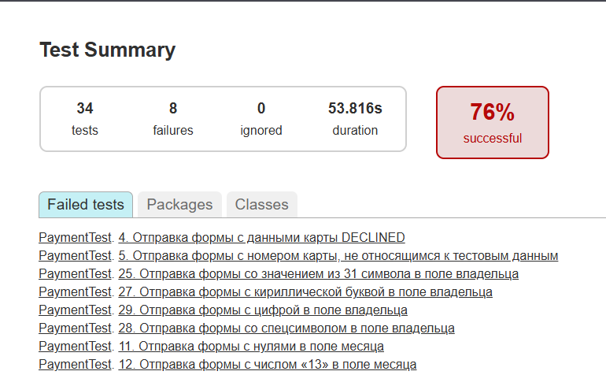
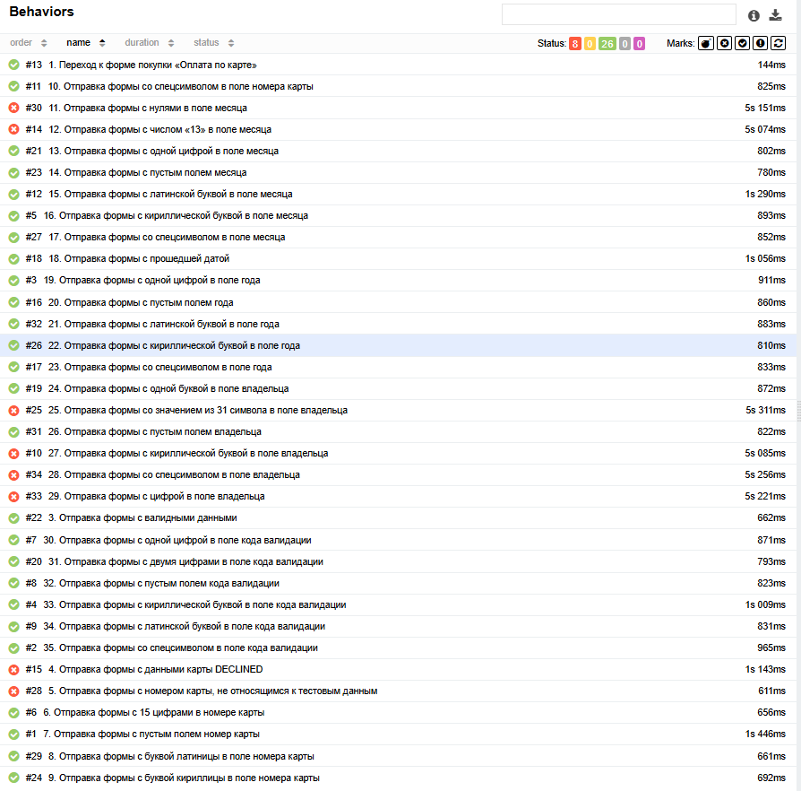

# Отчет по итогам тестирования
## Краткое описание
Настоящий документ содержит результаты тестирования комплексного сервиса "Путешествие дня", предлагающего приобрести предложенный продукт двумя способами (оплата по карте и приобретение в кредит по данным карты), взаимодействующего с СУБД и API банка. Тестирование осуществлялоь на основании [технического задания](https://github.com/netology-code/aqa-qamid-diplom), разработанного на его основе [плана автоматизации тестирования](), включало ручное прохождение тестовых сценариев, автоматизированное тестирование в части навигации по страницам сервиса, проверки функциональности "Оплаты по карте" и записи статуса оплаты в базу данных тестируемого приложения.

**Предоставленные тестовые данные**: номера одобренной и отклонённой карт, общие требования к заполнению полей.

**Использовалось тестовое окружение**:
* *Операционная система*: Windows 10 Pro Версия 22H2
* *IDE*: IntelliJ IDEA 2025.2.1 (Community Edition)
* *Java*: Open JDK 11
* *Docker Desktop* 4.55.0 (213807)
* *Браузер*: Google Chrome Версия: 143.0.7499.42 (Официальная сборка) (64 бит)

## Количество тест-кейсов

Составлено 35 тестовых сценария:
* 2 сценария проверки навигации (сценарий перехода на страницу "Кредит по данным карты" протестирован в ручном режиме, так как данная странице не охватывалась автоматизированным тестированием);
* 32 сценария проверки заполнения и отправки веб-формы на странице "Оплата по карте", в том числе тест-кейсы, проверяющие:
    * классы эквивалентности,
    * граничные значения,
    * статус проведённой операции.

## Процент успешных и не успешных тест-кейсов
Тестирование показало падение 8 из 35 сценариев, что в процентном соотношении составляет 23,53% неуспешных и 76,47% успешных сценариев от общего количества. По всем выявленным дефектам составлены 19 [баг-репорты](https://github.com/cedric-ko/qamid-diplom/issues).
Ниже представлены отчёты:
1. Gradle

2. Allure

### Общие рекомендации
* устранить дефекты в соответствии с баг-репортами;
* составить документацию на тестируемый сервис;
* включить в код страницы тестовые метки для обеспечения устойчивого автоматизированного тестирования.